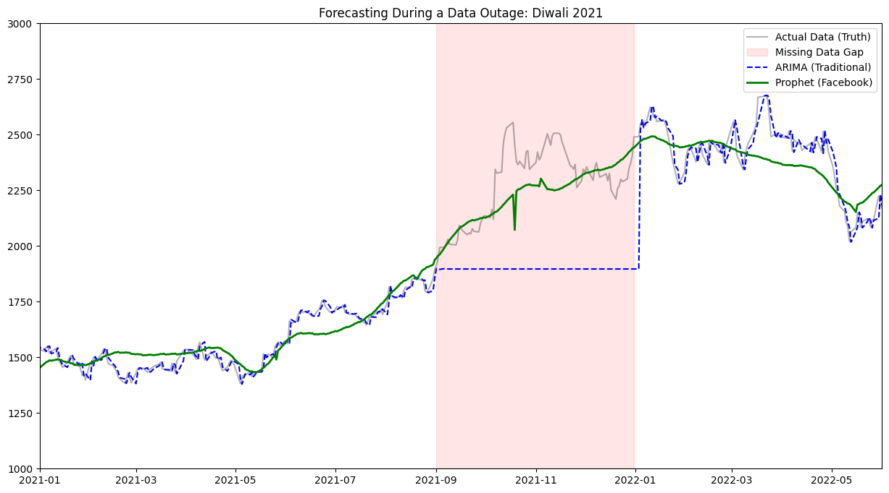
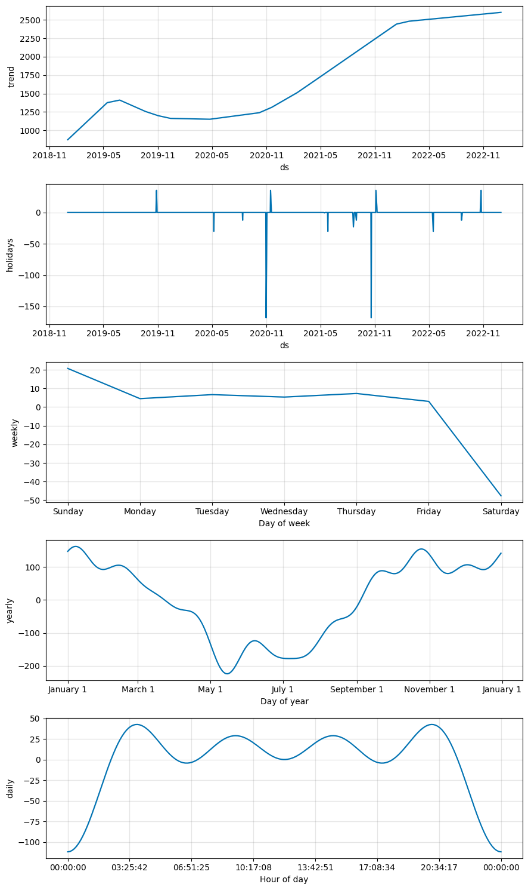
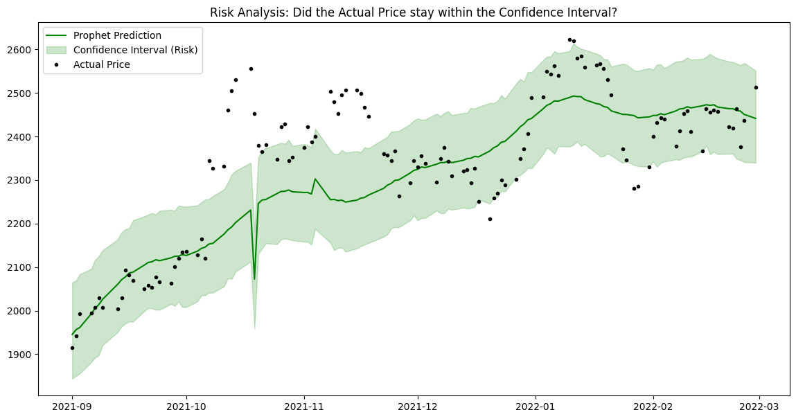

# Prophet vs. ARIMA: Operational Forecasting During Data Outages

[](https://colab.research.google.com/github/krasper707/prophet-vs-arima-operations/blob/main/forecasting.ipynb)

### Can modern algorithms recover seasonality when the data goes missing?



## The Project

This project explores **Operational Resilience**. It simulates a supply chain data disaster—losing sales records right before a major festive season—and tests which forecasting model can recover the trend:

1.  **ARIMA** (Traditional Time Series)
2.  **Facebook Prophet** (Modern Additive Model)

## 🇮🇳 The "Indian Context" Twist

Instead of generic sales data, I used **Titan Company (TITAN.NS)** stock prices as a proxy for Indian consumer sentiment.

- **The Challenge:** Titan sees massive spikes during **Diwali/Dhanteras**.
- **The Sabotage:** I intentionally deleted 4 months of data (Sept 2021 - Dec 2021), blinding the models to the critical Q4 festive season.

## The Experiment

1.  **Data Acquisition:** Downloaded 4 years of daily data via `yfinance`.
2.  **The Blackout:** Created a `NaN` hole in the training data covering the 2021 Diwali season.
3.  **Model Fitting:**
    - _ARIMA:_ Forward-filled gaps (standard limitation fix) and fit an (5,1,0) order.
    - _Prophet:_ Fitted natively with `daily_seasonality=True` and `add_country_holidays(country_name='IN')`.

## Key Findings

- **ARIMA Failed:** Because it relies on immediate past values (autoregression), it flatlined during the missing data period. In a real supply chain, this would lead to a total stock-out.
- **Prophet Succeeded:** By leveraging **Yearly Seasonality** and **Holiday Regressors**, Prophet successfully "hallucinated" the Diwali spike even though the specific data points were deleted.

## Visual Analysis

**1. The Decomposition (How Prophet "thinks"):**

_Prophet breaks the data into Trend, Weekly patterns, and Yearly Seasonality. Note the massive Q4 spike in the Yearly component._

**2. Risk Analysis:**

_The green shaded area represents the confidence interval. The actual data (black dots) largely stayed within Prophet's predicted risk zone._

## 🛠️ Installation & Usage

To run this experiment locally:

1. Clone the repo:
   ```bash
   git clone https://github.com/krasper707/prophet-vs-arima-operations.git
   ```
2. Install dependencies:
   ```
   pip install -r requirements.txt
   ```
3. Run the notebook forecasting.ipynb.

## Credits

- Paper: [Prophet: Forecasting at Scale (Taylor & Letham, 2018)](https://peerj.com/preprints/3190.pdf)
- Data Source: Yahoo Finance
